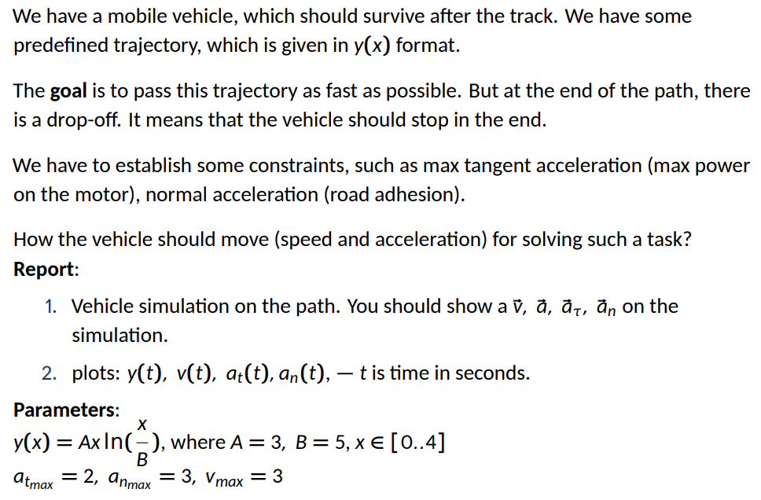
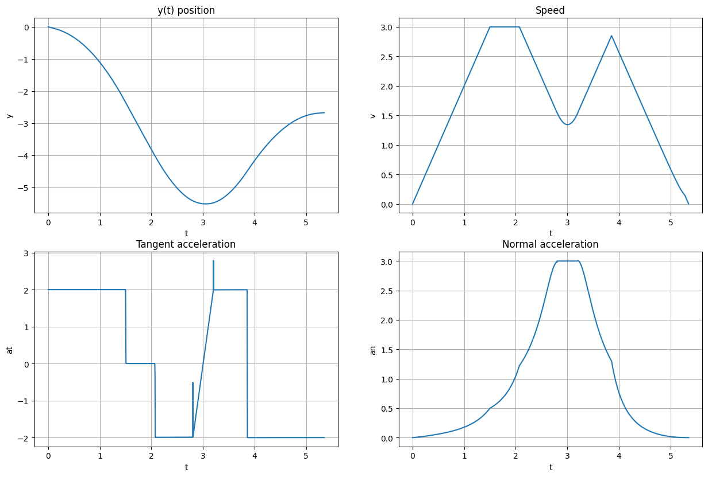
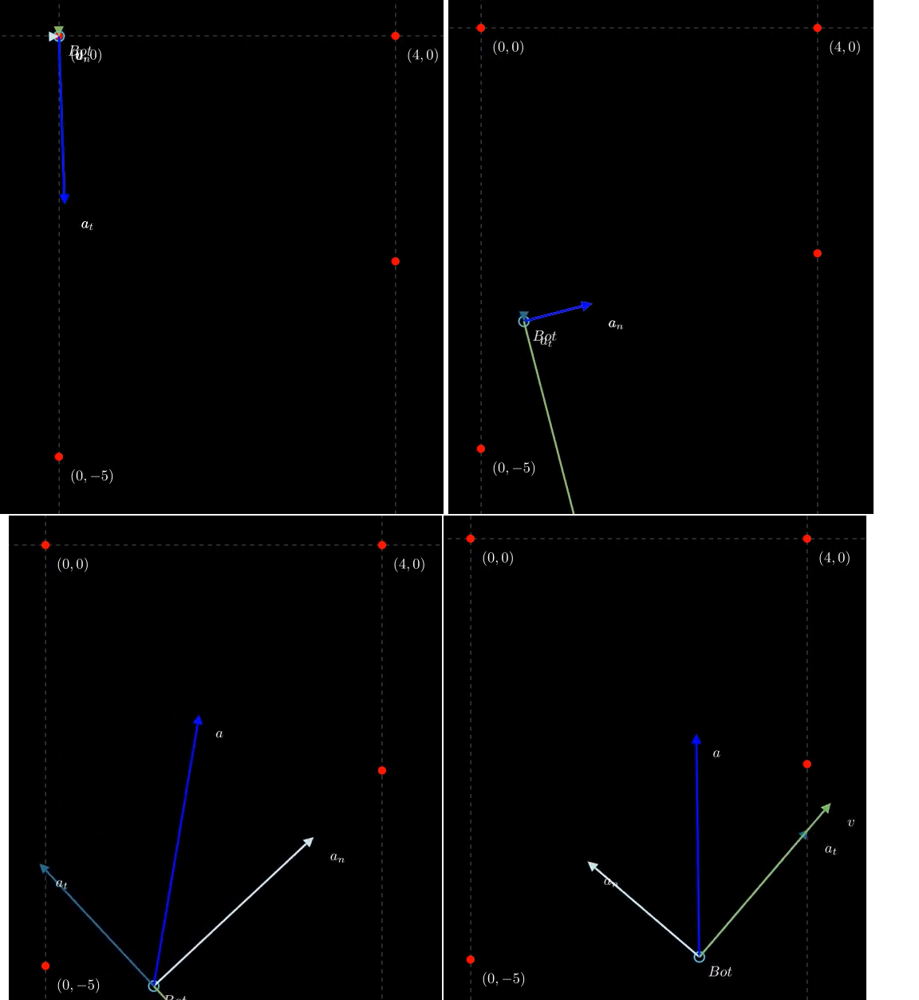

# Big Homework 1 Report
Kuklin Pavel, B22-RO-01

### Tools
Google Colab, Python (manim, numpy, sympy, matplotlib libraries); Github, Markdown.

## Task 1

### Task description

### [Simulation link](https://colab.research.google.com/drive/16ziQ4duisb2FtsYrLwfYP_u7RPBvNeoT#scrollTo=CcZKcVd2XLa7&line=1&uniqifier=1)

### Task explanation

From v(x) find:

- $ds = \sqrt{1 + v'(x)^2}\ dx$. Numerically integrate it to get s - passed path.

- Tangent circle radius as $$R = \frac{\sqrt{1 + v'(x)^2}}{|(\frac{d}{dt}\vec{T})|}$$ where $\vec{T} = \frac{1}{\sqrt{1 + v'(x)^2}} [1; v'(x)]^T$ - unit-vector of speed.

- Speed bound by $R$ and $a^n_{max}$ as $v_{bound} = \sqrt{a^n_{max}R}$
- Tangent speed bound by $R$ and $a^n_{max}$ as $$ a^t_{bound} = \frac{dv}{dt} = \frac{vdv}{ds} = \frac{v_{bound}\ v_{bound}'}{s'} $$

See graphs: interval $[B, C]$ can be followed by $v_{bound}$. Intervals $[A, B]$ and $[C, D]$ should be followed with constant max deceleration/acceleration.

From
$$ a^t = \frac{dv}{dt} = \frac{vdv}{ds} = v\frac{v'}{s'} = v\frac{v - v_{prev}}{s'} $$
We can find new $v$ based on previous $v_{prev}$, $s'$ and constant $a^t_{max}$ (quadratic eq.). Use this to find constant max de-/acceleration parts.

Combine parts of speed graph.

Find $t(x)$ by numerically integrating $dt = \frac{ds}{v}$. Total simulation time is approximately $5.35$

Combine t(x) and other values(x) to obtain plots for values(t).

Simulate by plots.

### Plots

Plot of $a^t(t)$ has two spikes due to concatenation of point arrays and numerical errors. 

### Simulation screenshots
