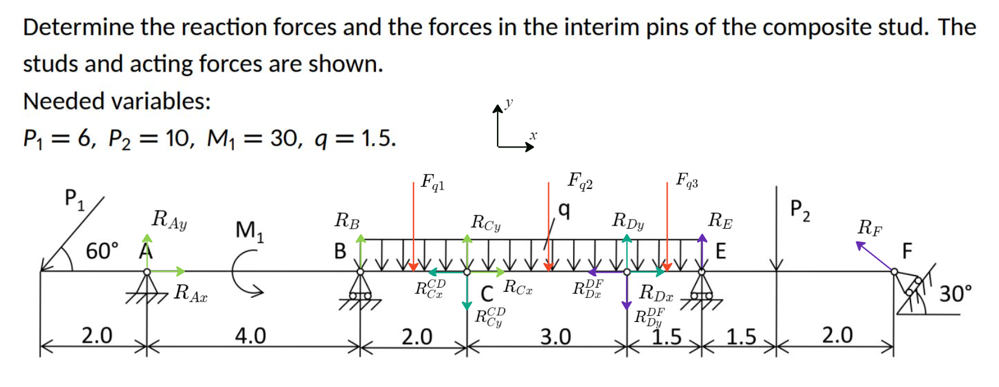
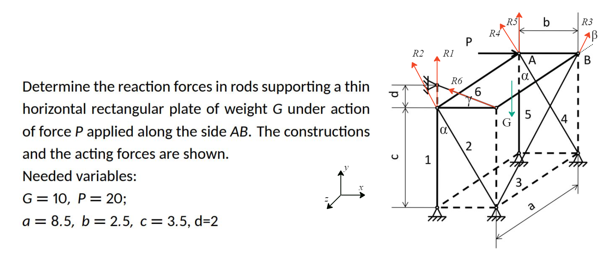

# Homework 4 Report
Kuklin Pavel, B22-RO-01

### Tools
Google Colab, Python (manim, numpy, sympy, matplotlib libraries); Github, Markdown.

[Calculations here](https://colab.research.google.com/drive/18zhA19c-TkQzV1N0s_VM8Ckswt2t-Hnr?usp=sharing)

## Task 1

### Task description

### Task explanation
**Research object:** 3 rods: OC, CD, DF.
2d task, all rods are fixed.

**Force analysis:**

$M; \ \ P_2; \ \ P_{1x} = -P_{1}cos(60); \ \ P_{1y} = -P_{1}sin(60);$

$F_{q1} = 2q; \ \ F_{q2} = 3q; \ \ F_{q3} = 1.5q;$

$R_{Fx} = -R_{F}cos(90 - 30); \ \ R_{Fy} = R_{F}sin(90 - 30);$

$R_{Ax}, R_{Ay}, R_{B}, R_{Cx}, R_{Cy}, R_{Dx}, R_{Dy}, R_{E}, R_{F}$ - ?

**Solution:**

Equations for OC:
$ \begin{equation} \begin{cases}
      X:   -P_{1}cos(60) + R_{Ax} + R_{Cx} = 0\\
      Y:   -P_{1}sin(60) + R_{Ay} + R_{B} - F_{q1} + R_{Cy} = 0\\
      M_A: 2P_{1}sin(60) + M_1 + 4R_{B} - 5F_{q1} + 6R_{Cy} = 0
\end{cases} \end{equation} $

Equations for CD:
$ \begin{equation} \begin{cases}
      X:   -R_{Cx} + R_{Dx} = 0\\
      Y:   -R_{Cy} + R_{Dy} - F_{q2} = 0\\
      M_C: -1.5F_{q2} + 3R_{Dy} = 0
\end{cases} \end{equation} $

Equations for DF:
$ \begin{equation} \begin{cases}
      X:   -R_{Dx} - R_{F}cos(90 - 30) = 0\\
      Y:   -R_{Dy} - F_{q3} + R_{E} - P_2 + R_{F}sin(90 - 30) = 0\\
      M_D: -0.75F_{q3} + 1.5R_{E} - 3P_2 + 5R_{F}sin(90 - 30) = 0
\end{cases} \end{equation} $

9 unknown and 9 equations are solvable.
Using sympy to solve system of equations, we obtain **answer:**
$ \begin{equation} \begin{cases}
    R_{Ax} = 3.15717022351847 \\
    R_{Ay} = 2.88170441008005 \\
    R_{B} = 0.539431863306650 \\
    R_{Cx} = -8.87164810600941 \\
    R_{Cy} = -2.25000000000000 \\
    R_{Dx} = -8.87164810600941 \\
    R_{Dy} = 2.25000000000000 \\
    R_{E} = 11.6607142857143 \\
    R_{F} = -9.31491725589698
\end{cases} \end{equation} $

## Task 2

### Task description

### Task explanation
**Research object:** 1 object: upper plane.
3d task, plane is fixed.

**Force analysis:**
$P;$

$R_{2x} = -R_2sin\alpha; \ \ R_{2y} = R_2cos\alpha;$

$R_{3y} = R_3sin\beta; \ \ R_{3z} = -R_3cos\beta;$

$R_{4x} = -R_4sin\alpha; \ \ R_{4y} = R_4cos\alpha;$

$R_{6x} = -R_6cos\gamma; \ \ R_{6y} = R_6sin\gamma;$

$R_1, R_2, R_3, R_4, R_5, R_6$ - ?

**Solution:**

$ \begin{equation} \begin{cases}
      X:     -R_2sin\alpha - R_4sin\alpha - R_6cos\gamma + P = 0 \\
      Y:     R_1 + R_2cos\alpha + R_3sin\beta + R_4cos\alpha + R_5 + R_6sin\gamma - G = 0\\
      Z:     -R_3cos\beta = 0 \\
      M^x_A: -aR_1 - aR_2cos\alpha - aR_6sin\gamma + \frac{a}{2}G = 0 \\ 
      M^y_A: -aR_2sin\alpha -aR_6cos\gamma + bR_3cos\beta = 0 \\
      M^z_A:  bR_6sin\gamma + bR_3sin\beta - \frac{b}{2}G = 0\\
\end{cases} \end{equation} $

6 unknown and 6 equations are solvable.
Using sympy to solve system of equations, we obtain **answer:**
$ \begin{equation} \begin{cases}
    R_1 = 8.75000000000000 \\
    R_2 = -10.7529065838033 \\
    R_3 = 0.0 \\
    R_4 = 34.4093010681705 \\
    R_5 = -23.0000000000000 \\
    R_6 = 8.00390529679106
\end{cases} \end{equation} $
