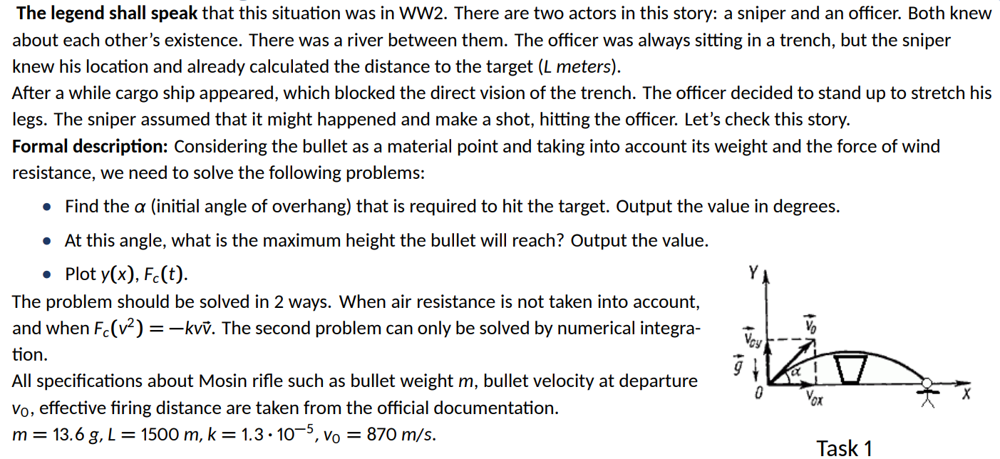
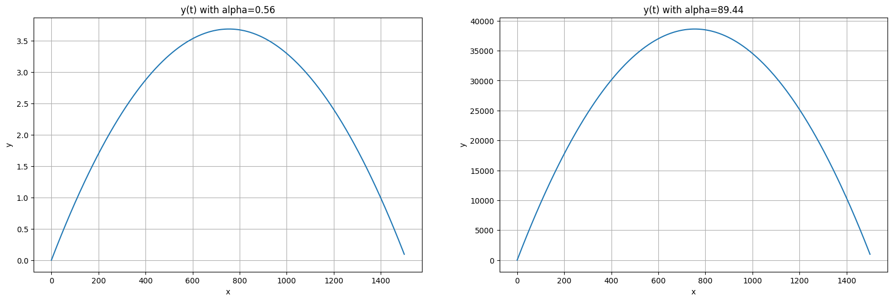
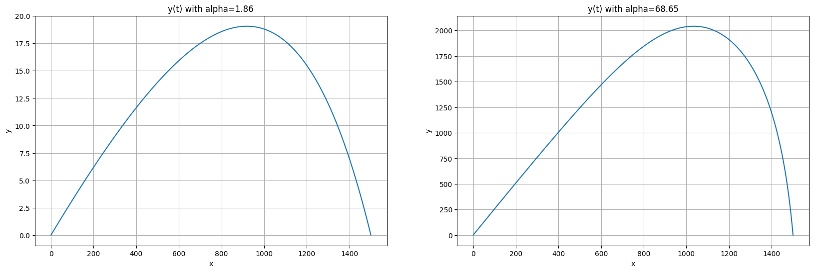
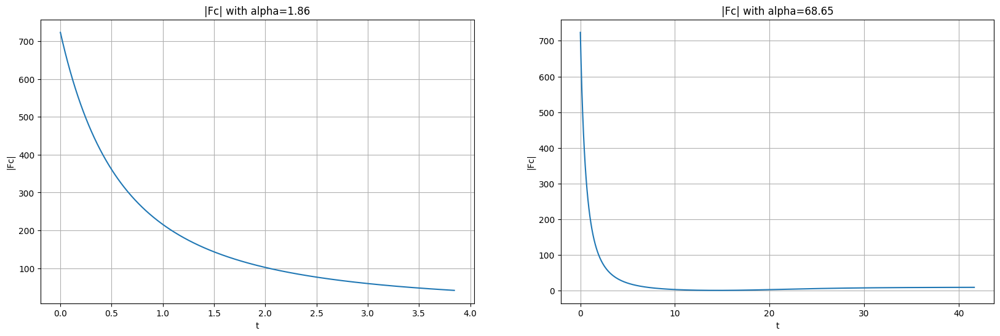
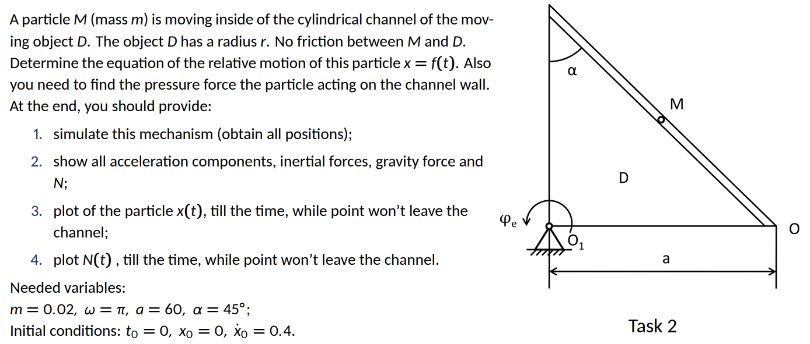

# Homework 5 Report
Kuklin Pavel, B22-RO-01

### Tools
Google Colab, Python (manim, numpy, sympy, matplotlib libraries); Github, Markdown.

### [Simulation and calculations link](https://g.co)

## Task 1

### Task description

### Task explanation

**R. O.:** bullet (particle)

**Conditions:**

- $\alpha - ?$
- $x_0 = 0,\ y_0 = 0,\ t_0 = 0$
- $x_1 = L,\ y_1 = 0,\ t_1 - ?$

**1. Without friction:**

**Force analysis:**

$\vec{F_g} = m\vec{g}$

**Solution:**

$m\vec{a} = \vec{F_g}$

Here, axis $x$: $ ma_x = 0;\ \ddot x = 0;\ \dot x = C_1 = v_0cos\alpha;\ x = v_0tcos\alpha $.

Axis $y$: $ ma_y = -mg;\ \ddot y = -g;\ \dot y = -gt + C_1;$ from initial conditions, $C_1 = v_0sin\alpha;\ y = \frac{-gt^2}{2} + v_0tsin\alpha + C_2;$ from initial conditions, $C_2 = 0$.

Therefore, fromn condition 1: 
$v_0tcos\alpha = L$ and $\frac{-gt^2}{2} + v_0tsin\alpha = 0;$

Solving these equations (sympy is used), **we obtain two angles**: $ \approx 0.56^o$ and $ \approx 89.44^o$ **with maximum height**$ \approx 3.69$ and $ \approx 38613.66$.

**2. With friction:**

**Force analysis:**

$\vec{F_{fr}} = -kv\vec{v};\ \vec{F_g} = m\vec{g}$

**Solution:**

$m\vec{a} = \vec{F_{fr}} + \vec{F_g}$

Here, $\vec{X}$ is used to denote position of bullet; $\vec{X} = \begin{pmatrix} x \\ y \end{pmatrix}$;

$m \ddot{\vec{X}} = -k|\dot{\vec{X}}|\dot{\vec{X}} + m\vec{g}$. Then

$ \begin{pmatrix} \dot{\vec{X}} \\ \ddot{\vec{X}} \end{pmatrix} = 
\begin{pmatrix} 0 & I \\ 0 & -k|\dot{\vec{X}}|\end{pmatrix}
\begin{pmatrix} \vec{X} \\ \dot{\vec{X}} \end{pmatrix} + 
\begin{pmatrix} 0 \\ m\vec{g} \end{pmatrix} $

Also, vector form of initial velocity is $ \vec{v_0} = \begin{pmatrix} cos\alpha \\ sin\alpha \end{pmatrix} v_0 $.

Numerically integrating DE described above until $y = 0$ gives us $x$ - distance, travelled by bullet until hitting ground.

Continuously changing $\alpha$, we can approximate angle where $x = L$. **These angles are** $\approx 1.86$ and $\approx 68.65$ **with maximum height** $19.07$ and $2042.05$.

### Plots
**2. Without friction:**

**2. With friction:**

## Task 2

### Task description

### Task explanation

### Plots

### Simulation screenshots
