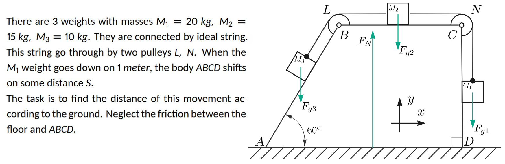
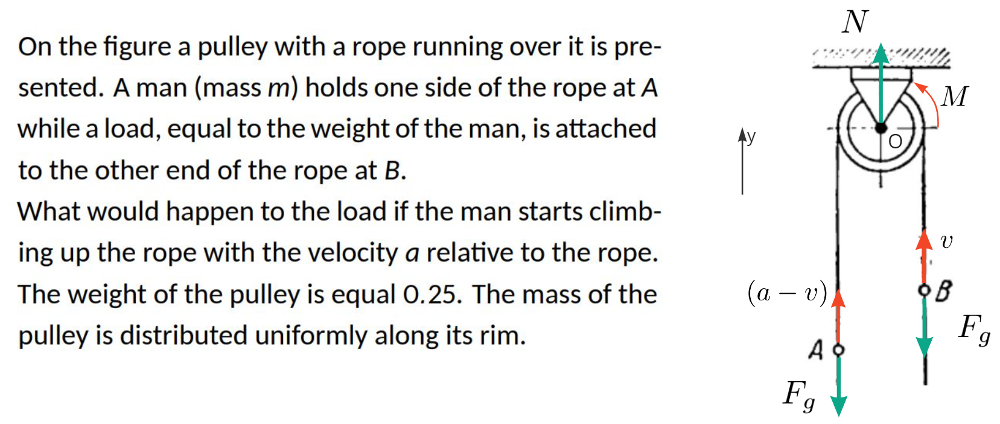

# Homework 6 Report
Kuklin Pavel, B22-RO-01

### Tools
Github, Markdown.

## Task 1

### Task description

### Task explanation

**R. O.:** system of weights $M_1$, $M_2$, $M_3$ and body $ABCD$ with mass $M_4 = 100\ kg$.

**Conditions:**

0. $t_0 = 0, x_{c0} = x_0, \vec{\dot x_{c0}} = 0; x_{10} = x_1, y_{10} = y_1, x_{20} = x_2, x_{30} = x_3, x_{40} = x_4; $
1. $y_{11} = y_1 - 1$, all else unknown.

**Force analysis:**

$F_N; \ \ F_{g1} = M_1g; \ \ F_{g2} = M_2g; \ \ F_{g3} = M_3g.$

**Solution:**

Use theorem about motion of center of mass.

$$\vec{F_{g1}} + \vec{F_{g2}} + \vec{F_{g3}} + \vec{F_N} = m\vec{a_c}$$

Force projection on $x$: $0 = m\vec{a_c} = m\vec{\ddot x_c} $.

Then by integration obtain $\vec{\dot x_c} = 0$ and $x_c = x_0$.

Assume in condition 1, body $ABCD$ moved by $\Delta$ along $x$; then

$x_{11} = x_1 + \Delta; $

$x_{21} = x_2 + \Delta - (y_{11} - y_{10}) = x_2 + \Delta + 1; $

$x_{31} = x_3 + \Delta - (y_{11} - y_{10})cos(60^o) = x_3 + \Delta + 0.5; $

$x_{41} = x_4 + \Delta; $

Therefore:

$$x_{c0} = x_{c1}; $$

$$\frac{M_1x_1 + M_2x_2 + M_3x_3 + M_4x_4}{M_1 + M_2 + M_3 + M_4} =
\frac{M_1(x_1 + \Delta) + M_2(x_2 + \Delta + 1) + M_3(x_3 + \Delta + 0.5) + M_4(x_4 + \Delta)}{M_1 + M_2 + M_3} $$

$$0 = M_1\Delta + M_2\Delta + M_2 + M_3\Delta + 0.5M_3 + M_4\Delta $$

$$\Delta = -\frac{M_2 + 0.5M_3}{M_1 + M_2 + M_3 + M_4} \approx -0.14. $$

**Answer:** body will move by $0.14\ m$ to the left.

## Task 2

### Task description

### Task explanation

**R. O.:** system:

- $A$- mass $m$, relative speed to rope $a$
- $B$- mass $m$
- block $c$- mass $0.25m$

**Conditions:**

0. $t_0 = 0, v_{A0} = 0, v_{B0} = 0, \omega_{c0} = 0$
1. relative speed $A$ to rope - $a$, all other unknown

**Kinematics:**

let $v_{B1} = v$, then $\omega_{c1} = \frac{v}{r}$ and $v_{A1} = (a-v)$.

$M_A = -r(mv_{A1}) $,

$M_B = r(mv_{B1}) $,

$M_c = J\omega_{c1} = \frac{m}{4}r^2\frac{v}{r} = \frac{1}{4}mvr $,

**Force analysis:**

$F_g = mg; $

**Solution:**

Using Theorem on change of angular momentum of a system

Along axis $y$:

$\frac{d}{dt}(F_g - F_g) = -rmv_{A1} + rmv_{B1} + \frac{1}{4}mvr$

$0 = v-a + v + \frac{1}{4}v$

$v = \frac{4}{9}a$

Answer: $\frac{4}{9}a$.