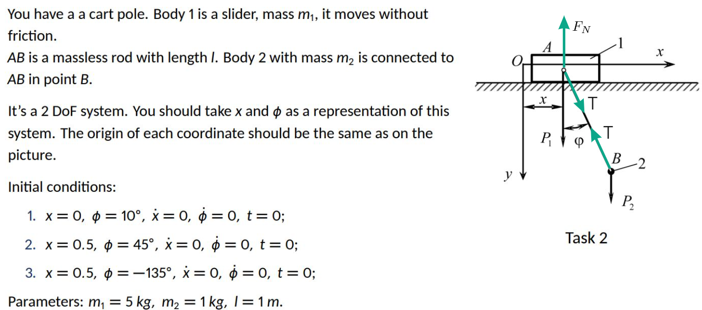
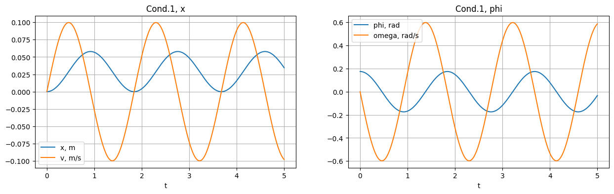
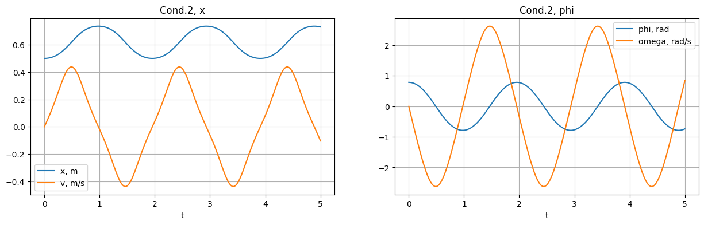
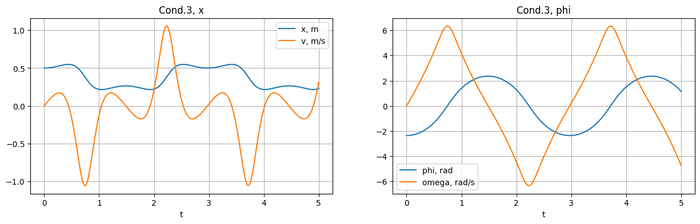
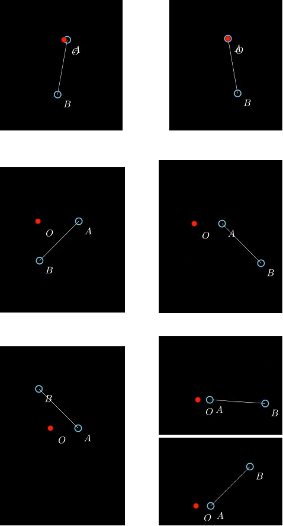

# Homework 7 Report
Kuklin Pavel, B22-RO-01

### Tools
Github, Markdown.

## Task 2

### [Simulation link](https://colab.research.google.com/drive/1lG0wil2WqPwXW1ST9A4GBCOPv6vBcpFl?usp=sharing)

### Task description

### Task explanation

**R. O.:** system:

- $A$ - particle, linear motion
- $B$ - particle, planar motion

**Conditions:**

Shown on description;

"New": $t - ?, \phi - ?, x - ?, \dot \phi - ?, \dot x - ?$.

**Kinematics:**

Body $A$:

- $x_A = x, y_A = 0$
- $\dot x_A = \dot x, \dot y_A = 0$
- $\ddot x_A = \ddot x, \ddot y_A = 0$

Body $B$:

- $x_B = x + lsin\phi,\ y_B = lcos\phi$
- $\dot x_B = \dot x + l \dot \phi cos \phi,\ \dot y_B = - l \dot \phi sin \phi$
- $\ddot x_B = \ddot x + l \ddot \phi cos \phi - l \dot \phi^2 sin \phi,\ \ddot y_B = - l \ddot \phi sin \phi - l \dot \phi^2 cos \phi$

**Force analysis:**

$ F_N; T; P_1 = m_1g; P_2 = m_2g$.

**Solution:**

Using Newton-Euler method:

Body $A$, axis $x$: $Tsin\phi = m_1\ddot x$

Body $B$, axis $x$: $-Tsin\phi = m_2(\ddot x + l \ddot \phi cos \phi - l \dot \phi^2 sin \phi)$

Body $B$, axis $y$: $-Tcos\phi + m_2g = m_2(- l \ddot \phi sin \phi - l \dot \phi^2 cos \phi)$

From here, we can express $\ddot x$ and $\ddot \phi$ in terms of $\dot \phi$ and $\phi$ and solve numerically:

$$\ddot x = \frac{m_2(gcos\phi + l \dot \phi^2)sin(\phi)}{(m_1 + m_2*sin^2\phi)}$$

$$ \ddot \phi = -\frac{(gm_1 + gm_2 + lm_2\dot \phi^2cos\phi)sin\phi}{l(m_1 + m_2sin^2\phi)} $$

**Plots:**

**Screenshots:**

